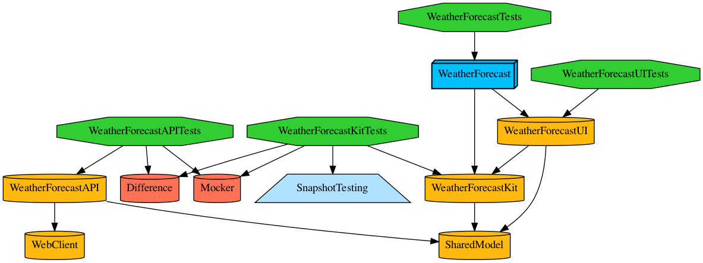
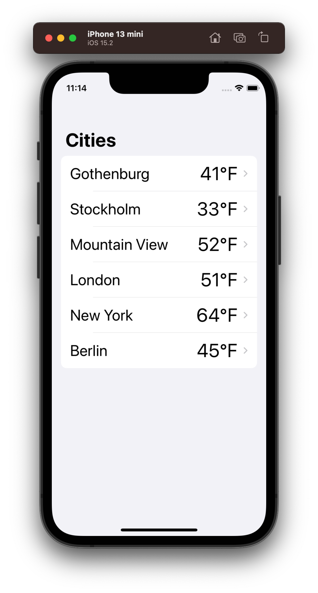
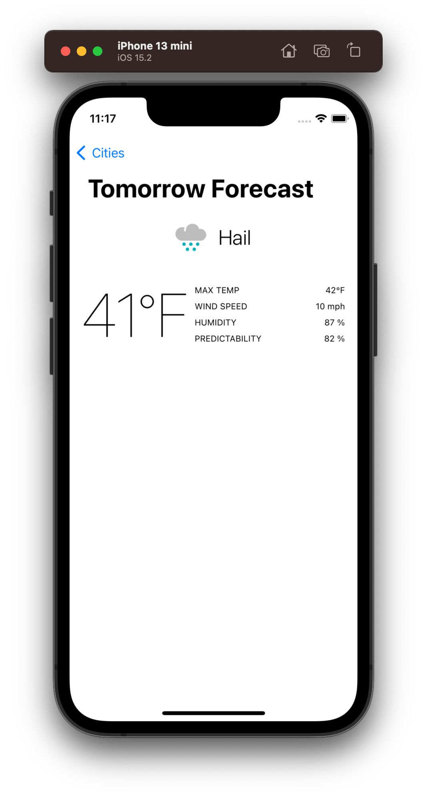

[](https://tuist.io)

# Volvo Cars 

This is an example app following the specs defined on the following:

## iOS Test Task

> As a part of the recruitment process at Volvo Cars we ask you to complete
> this coding assignment. The task has been kept simple and open, allowing
> for you (as the candidate) to put focus not only on the technical parts of
> the solution, but also on style, readability and maintainability. Please solve
> this assignment in the same fashion had you been given it as an employee,
> with real live users as the target audience in mind. That said, we do not
> want you to spend more than a day on this assignment.

### Requirements

- [x] The application should make use of the MetaWeather restful API. The API description can be found here: https://www.metaweather.com/api
- [x] The application should show tomorrow’s weather forecast in the
following six cities: 
        - [x] Gothenburg
        - [x] Stockholm
        - [x] Mountain View 
        - [x] London
        - [x] New York 
        - [x] Berlin
- [x] The forecast for a specific city should be presented in the
application by: 
        - [x] Showing a corresponding weather icon. You can use the icons
available through `https://www.metaweather.com/static/img/weather/png/6
4/<weather>.png`
        - [x] Showing a few additional forecast data of your choice (as
available through MetaWeather) 
- [x] There should be at least one user interaction in the application. Eg
tapping to see more weather details
- [x] Your code should be unit tested. 

## Further Details 

Complete the task using UIKit and/or SwiftUI. A completed task consists
of a runnable iOS application.

## 🛠 How to run?

This project is using [tuist](https://github.com/tuist/tuist) to manage the xcode project generation and to help with the modularization of the project.
Moreover, it is also using [carthage](https://github.com/Carthage/Carthage) due to one dependency, be sure to install as well.

Before running the project we have to generate the xcode project.

### 🏗 How to generate the project?

First, be sure you have tuist installed on your environment.
The recommended way, is to run the following command:

```bash
curl -Ls https://install.tuist.io | bash
```

After successfully install tuist, you can run the following command

```bash
tuist generate
```

**OBS:** You might have to download the dependencies 

```bash
tuist dependencies fetch
```

## How to edit the project settings?

Just use tuist with the following command

```bash
tuist edit
```

Then, change the configuration.

## Points to evolve the project

- [ ] Write more tests
- [ ] Write UI tests
- [ ] Fix previews for each views
- [ ] Use the GenreView and the MoodView when needed
- [ ] Improve the routing/navigation


## Generate Dependencies Graph?

You can use tuist to generate a graph

```bash
$ tuist graph
```

The current graph



## Screenshots tests

Be aware that you should choose the iPhone 13 Pro Max with iOS 15.2 to be able to run the screeshot tests.

Like the comment added on the screenshot test file 

```
// Run this test with iPhone 13 Pro Max
// iOS 15.2
// Otherwise the test will break
```

## Screenshots



